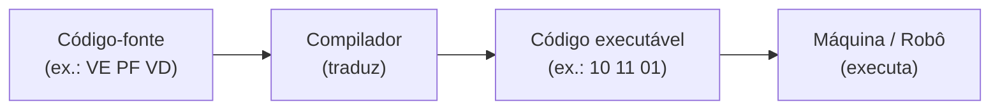
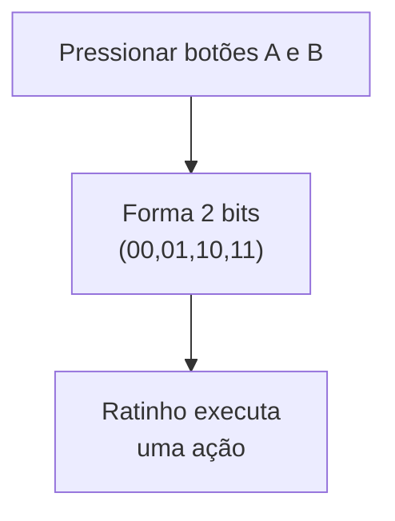
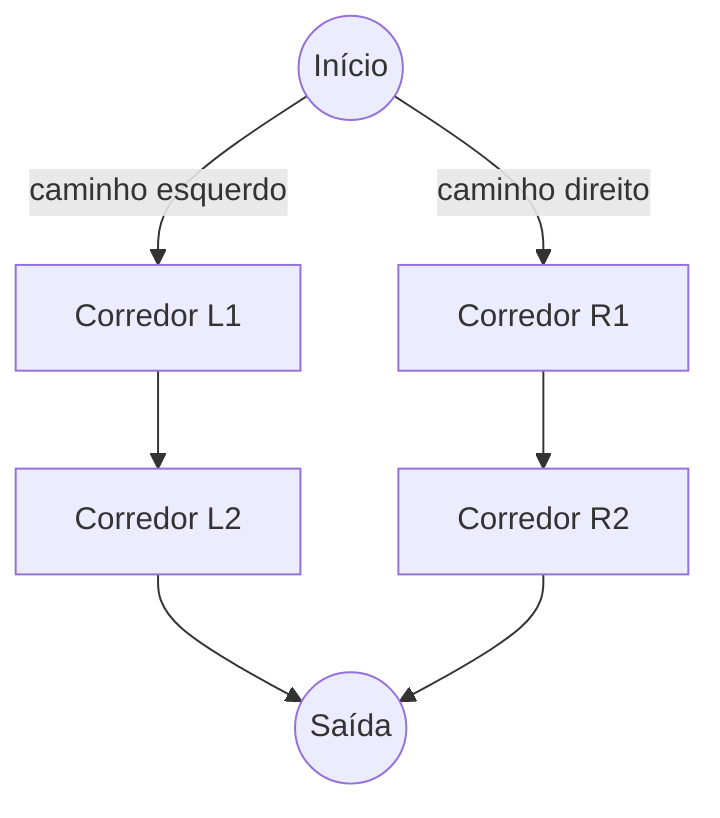
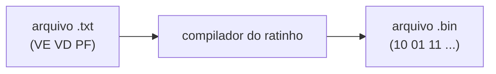
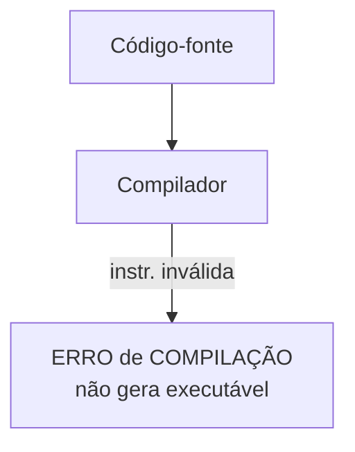
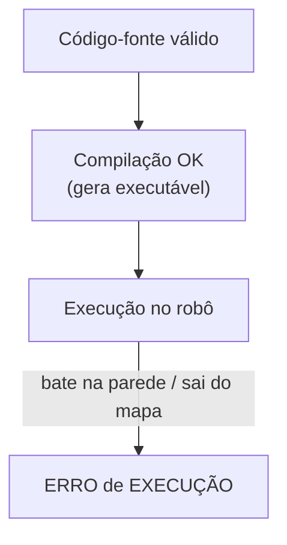

# Introdução à Programação: do 0 e 1 ao C++ (com um ratinho robô)

Este repositório é um material introdutório (bem do começo mesmo!) para entender como um computador (ou um robô) “entende” instruções — e como surgem conceitos como **código-fonte**, **compilação**, **código executável**, além de **erros de compilação** e **erros de execução**.

A ideia: vamos imaginar um ratinho robô que recebe comandos a partir de duas chaves push (dois botões). A partir disso, vamos construir uma “linguagem” mais amigável e entender como um compilador pode traduzir instruções.

## Objetivos de aprendizagem

Ao final deste roteiro, você deverá conseguir explicar com suas palavras:

- Linguagem de máquina
- Linguagem de baixo nível
- Linguagem de alto nível
- Código-fonte
- Código executável
- Compilação
- Erros de compilação
- Erros de execução

E também deverá conseguir:

- Escrever uma sequência de comandos binários para guiar o ratinho num labirinto simples
- Criar uma linguagem simples (**VE**, **VD**, **PF**) para facilitar a escrita dos comandos
- Implementar um “compilador” que traduza essa linguagem para binário
- Criar o comando **PA** (passo para trás) usando uma sequência de comandos existentes
- Identificar e exemplificar erros de compilação e de execução

## A história do ratinho robô

Imagine um ratinho robô com:

- 2 botões (chaves push): **A** e **B**
- Cada botão pode estar em **0** (solto) ou **1** (pressionado)

Isso gera 4 combinações binárias possíveis:

```text
(A,B) ∈ {00, 01, 10, 11}
```

Agora vamos associar cada combinação a um movimento:

| Botão A | Botão B | Binário | Ação do ratinho |
| --- | --- | --- | --- |
| 0 | 0 | 00 | Sem operação (não faz nada) |
| 0 | 1 | 01 | Virar 90° à direita |
| 1 | 0 | 10 | Virar 90° à esquerda |
| 1 | 1 | 11 | Passo para frente (anda 1 “casa”) |

✅ Essas sequências de 0 e 1 são o que chamamos de **linguagem de máquina**: instruções diretamente entendidas pelo “hardware” (no nosso caso, pelo ratinho).

## Conceitos básicos (com o ratinho como exemplo)

### Linguagem de máquina

É a linguagem do nível mais baixo, feita de bits (0 e 1), que o dispositivo consegue interpretar diretamente.

Exemplo:

```text
11 11 01 11
```

(anda, anda, vira à direita, anda)

### Linguagem de baixo nível

É uma linguagem mais próxima da máquina, mas mais legível para humanos do que 0 e 1.
Um exemplo clássico é *Assembly*, que usa “apelidos” (mnemônicos) para instruções.

No nosso caso, a linguagem com **VE**, **VD**, **PF** vai parecer uma linguagem de baixo nível.

### Linguagem de alto nível

É mais próxima da linguagem humana e mais confortável para programar: C++, Python, Java, etc.

Em C++, você escreve o que quer fazer com estruturas mais ricas (funções, variáveis, `if`, loops).

### Código-fonte

É o texto que você escreve em uma linguagem (alta ou baixa), antes de virar executável.

Exemplo: um arquivo `.cpp` (C++) ou um arquivo `.txt` com `VE`, `PF`, `PF`, `VD`...

### Código executável

É o resultado pronto para ser executado pela máquina (ou pelo robô).

Exemplo: para o ratinho, pode ser um arquivo só com `00 01 10 11` em sequência.

### Compilação

É o processo de traduzir código-fonte para código executável (ou para algo mais próximo disso).

Mapa visual do processo (Mermaid):



## Parte 1 — Programando em “linguagem de máquina” (0 e 1)

### Como o ratinho executa

Ele lê **par a par** (2 bits por comando) e executa o movimento correspondente:



### O labirinto simples (um quadrado com dois caminhos)

Imagine um labirinto em forma de “quadrado/corredor”, onde dá para chegar ao final por dois caminhos: pela esquerda ou pela direita.

Representação como grafo (você escolhe **ESQUERDA** ou **DIREITA**):



### Regras para a sua sequência

- Considere que o ratinho começa virado para cima (norte).
- Para andar em um corredor, ele precisa usar **PF (11)**.
- Para escolher esquerda/direita em uma bifurcação, ele precisa virar:
  - Direita: `01`
  - Esquerda: `10`

### Atividade 1 — Linguagem de máquina

1. Escreva uma sequência de comandos binários (usando apenas `00`, `01`, `10`, `11`) para o ratinho sair do **Início** e chegar na **Saída** pelo caminho esquerdo.
2. Escreva outra sequência para chegar pelo caminho direito.

💡 Dica: para seguir por um caminho, normalmente você faz:

- virar (se necessário)
- dar passos para frente (`11`)
- virar de novo (se necessário)
- continuar

## Parte 2 — Criando uma linguagem mais fácil (VE, VD, PF)

Escrever `10 11 11 01 11 ...` é chato e fácil de errar. Então vamos criar uma linguagem “humana”:

| Instrução | Significado | “Compila” para |
| --- | --- | --- |
| VE | virar 90° à esquerda | 10 |
| VD | virar 90° à direita | 01 |
| PF | passo para frente | 11 |

✅ Essa linguagem é parecida com baixo nível: ainda está bem próxima da máquina, mas mais legível.

Exemplo de “programa” (código-fonte) para o ratinho:

```text
VE
PF
PF
VD
PF
```

E o “executável” correspondente (binário):

```text
10 11 11 01 11
```

## Parte 3 — E se existisse um “compilador” para isso?

Um compilador poderia:

- Ler seu arquivo com `VE`, `VD`, `PF`
- Verificar se as instruções existem
- Traduzir cada uma para `00`/`01`/`10`/`11`
- Gerar um arquivo de saída com o binário



### Atividade 2 — Implementando o compilador em C++

- Faça um programa em C++ que leia um arquivo texto com instruções `VE`, `VD`, `PF` (uma por linha).
- Para cada linha, escreva no arquivo de saída o binário correspondente (`10`, `01`, `11`).
- Se aparecer uma instrução desconhecida, pare e mostre uma mensagem de erro (**erro de compilação**, veremos já já).

## Desafio — Criando o comando PA (passo para trás)

Nosso ratinho não tem um comando direto de “andar para trás”.

Mas ele sabe:

- virar esquerda (`VE`)
- virar direita (`VD`)
- andar para frente (`PF`)

### Atividade 3 — “PA” como uma sequência de instruções

1. Proponha uma sequência usando apenas `VE`/`VD`/`PF` que faça o ratinho dar um passo para trás e terminar na mesma direção original.

💡 Dica forte: “andar para trás” pode ser feito como:

1) virar 180°
2) andar para frente
3) virar 180° de novo

➡️ Em termos de `VE`/`VD`, virar 180° pode ser: `VE` + `VE` ou `VD` + `VD`.

Exemplo (uma possível expansão de `PA`):

```text
VE
VE
PF
VE
VE
```

2. Agora implemente no seu compilador o comando `PA`:
   - Quando o compilador ler `PA`, ele deve **expandir** para a sequência equivalente (como se fosse um “atalho”).

## Entendendo erros: compilação vs execução

### Erros de compilação

Acontecem quando o código-fonte tem algo que o compilador não entende ou não aceita.

No nosso ratinho, isso pode acontecer se você escrever uma instrução inválida:

```text
VE
PF
XX
PF
```

✅ O compilador deve reclamar algo como:

```text
Instrução desconhecida: XX na linha 3
```



### Erros de execução

Acontecem quando o programa compilou, mas ao executar acontece um problema.

No ratinho, exemplos de erro de execução:

- Mandar `PF` e ele bater numa parede
- Mandar `PF` e sair do labirinto
- Entrar em loop (ficar repetindo comandos sem parar)



## Exemplos em C++ (para conectar com “programação de verdade”)

### Exemplo de erro de compilação em C++

Código com erro (falta `;`):

```cpp
#include <iostream>
using namespace std;

int main() {
    cout << "Oi"
    return 0;
}
```

O compilador (por exemplo, `g++`) normalmente vai apontar que está faltando algo na linha do `cout`.

### Exemplo de erro de execução em C++

Código que compila, mas pode falhar em execução (divisão por zero):

```cpp
#include <iostream>
using namespace std;

int main() {
    int x = 10;
    int y = 0;
    cout << (x / y) << endl; // erro em execução
    return 0;
}
```

✅ Compila.
❌ Mas ao rodar, pode dar erro (depende do sistema/ambiente), porque dividir por zero é um problema na execução.

## Checklist de entrega (sugestão)

- [ ] Sequência binária para caminho esquerdo do labirinto
- [ ] Sequência binária para caminho direito do labirinto
- [ ] Arquivo de entrada com `VE`/`VD`/`PF` (código-fonte do ratinho)
- [ ] Compilador em C++ que gera o “executável” binário
- [ ] Implementação do comando `PA`
- [ ] Exemplo de erro de compilação (instrução inválida) e mensagem amigável
- [ ] Exemplo de erro de execução (`PF` em parede, ou fora do mapa) e mensagem amigável

## Fechamento: o que você acabou de aprender (mesmo sem perceber)

Você fez, em miniatura, o que acontece no mundo real:

- Escreveu código-fonte
- Definiu uma linguagem mais legível (parecida com baixo nível)
- Traduziu para linguagem de máquina
- Entendeu por que existe compilação
- Viu a diferença entre:
  - erro de compilação (não dá para gerar executável)
  - erro de execução (executável existe, mas falha rodando)
